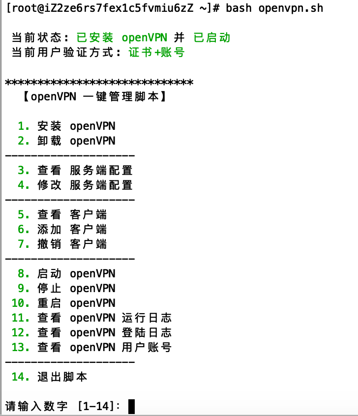

## openvpn-install.sh

### 说明
*此shell增加了 证书+密码 的用户验证方式*

直接运行以下命令：
```bash
$ wget -N --no-check-certificate https://git.io/JJNAu -O openvpn-install.sh && bash openvpn-install.sh
```

## openvpn.sh

### 预览


### 说明
**此shell整合了以下功能，相较于`openvpn-install.sh`更加完善，更方便使用（推荐）**
- 良好的用户界面
- 两种用户登陆验证模式：:one: 证书, :two: 证书+账号
- 支持证书与账号绑定，即账号只有在正确的证书下才有效 (模式:two:)
- 撤销证书时注销与之对应的账号 (模式:two:)
- 调整客户端证书生成路径至`/etc/openvpn/client/`, 吊销证书时将证书一并删除

### 使用
```bash
$ wget -N --no-check-certificate https://git.io/JJAjs -O openvpn.sh && bash openvpn.sh
```